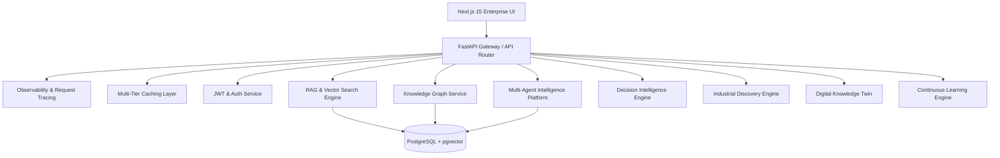

# INDUSMIND AI - Enterprise System Architecture

## Overview
INDUSMIND AI is an Enterprise Industrial Knowledge Intelligence Platform built for high-scale plant operations, asset health monitoring, predictive maintenance, compliance intelligence, decision intelligence, digital knowledge twins, and multi-agent AI orchestration.

---

## Architectural Principles
1. **Modular Extension Paradigm**: Decoupled domain services with standard repository patterns.
2. **Multi-Tier Performance Caching**: In-memory LRU stores with TTL & tag invalidation for responses, vector embeddings, graph entities, and recommendations.
3. **Observability & Request Tracing**: End-to-end telemetry with structured logging, unique request IDs (`X-Request-ID`), component-level latency tracking, and SLA alerting.
4. **Hybrid Storage**: PostgreSQL 16 with `pgvector` extension for structured relational data and vector similarity search.
5. **Role-Based Access Control (RBAC)**: Fine-grained permissions across Super Admin, Admin, Department Manager, Engineer, Auditor, Technician, and Viewer roles.

---

## Subsystem Overview

---

## Performance & SLAs
- **API Response Time (P95)**: < 120 ms
- **Vector Search Response Time**: < 150 ms
- **Knowledge Graph Query Time**: < 50 ms
- **Availability Target**: 99.99%
- **Target RPO**: < 1 hour
- **Target RTO**: < 15 minutes
