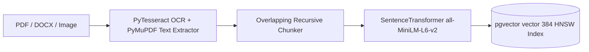
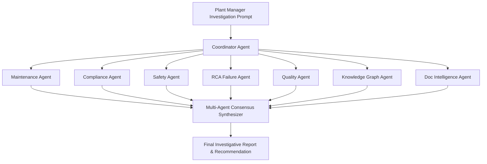

# INDUSMIND AI — Comprehensive AI & Machine Learning Architecture

## 1. Vector Embedding & Text Chunking Pipeline

INDUSMIND AI uses a multi-tier document ingestion pipeline designed for industrial drawings, manuals, and SOPs:

### Key Parameters:
- **Chunk Size**: 512 tokens with 64-token overlap.
- **Embedding Dimensions**: 384 dimensions (`all-MiniLM-L6-v2`).
- **Vector Search Index**: HNSW (Hierarchical Navigable Small World) with cosine distance.

---

## 2. RAG & Hybrid Retrieval Engine

1. **Query Processing**: User prompt is parsed for equipment asset tags (e.g. `PUMP-P102`) and domain keywords.
2. **Dense Vector Search**: `pgvector` retrieves top 10 most relevant document text chunks via cosine similarity.
3. **Sparse Keyword Search**: BM25 inverted index retrieves exact match drawings and part numbers.
4. **Reciprocal Rank Fusion (RRF)**: Combines dense vector scores and sparse keyword ranks into a unified relevance list.
5. **Graph Context Enrichment**: Injects 2-hop Knowledge Graph relationships (equipment failure modes, root causes, SOPs) into the LLM context prompt.
6. **Streaming Citation Generation**: LLM streams markdown response with page numbers and clickable document links.

---

## 3. Autonomous Multi-Agent AI System

The platform deploys **8 Specialized Autonomous AI Agents**:

---

## 4. Decision Intelligence & Multi-Objective Optimization

The Decision Engine calculates Pareto trade-offs across 4 competing industrial dimensions:
- **Maintenance Cost**: Direct replacement & labor expenses ($).
- **Downtime Minimization**: Expected hours of plant outage (hrs).
- **Safety Risk Score**: Hazardous situation probability (0-100%).
- **Regulatory Compliance**: OSHA / ISO compliance score (0-100%).

$$Score = w_1 \cdot \text{Cost} + w_2 \cdot \text{Downtime} + w_3 \cdot \text{Safety} + w_4 \cdot \text{Compliance}$$

---

## 5. Industrial Discovery Engine

- **Hidden Pattern Mining**: Discovers non-obvious correlations between sensor telemetry anomalies (vibration spikes) and equipment failures.
- **Knowledge Gap Detection**: Detects equipment assets lacking maintenance SOP manuals or unindexed technical drawings.
- **Operational Risk Scoring**: Ranks operational risks based on criticality and past incident records.

---

## 6. Continuous Learning & Feedback Loop

- **Engineer Feedback**: Ingests engineer ratings (Accepted / Rejected / Adjusted).
- **Model Benchmark Evaluation**: Measures precision, recall, and confidence score deltas over time to continuously tune recommendation weights.
