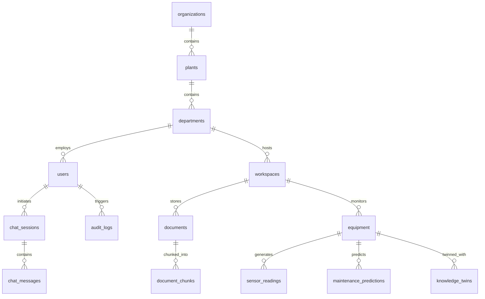

# INDUSMIND AI — Complete Database Architecture & Schema Documentation

## 1. Entity Relationship (ER) Diagram



---

## 2. Table Schemas & Column Specifications

### 2.1 User & Multi-Tenancy Tables
- **`organizations`**: `id` (PK, Integer), `name` (String, Unique), `description` (Text), `created_at` (DateTime).
- **`plants`**: `id` (PK, Integer), `organization_id` (FK -> organizations.id), `name` (String), `location` (String), `created_at` (DateTime).
- **`departments`**: `id` (PK, Integer), `plant_id` (FK -> plants.id), `name` (String), `code` (String), `created_at` (DateTime).
- **`users`**: `id` (PK, Integer), `email` (String, Unique), `hashed_password` (String), `full_name` (String), `role` (String), `job_title` (String), `department_id` (FK -> departments.id), `is_active` (Boolean), `created_at` (DateTime).
- **`refresh_tokens`**: `id` (PK, Integer), `user_id` (FK -> users.id), `token` (String, Unique), `expires_at` (DateTime).

### 2.2 Documents & Vector Knowledge Base
- **`documents`**: `id` (PK, Integer), `workspace_id` (FK -> workspaces.id), `title` (String), `filename` (String), `file_path` (String), `file_size` (Integer), `mime_type` (String), `status` (String), `created_at` (DateTime).
- **`document_chunks`**: `id` (PK, Integer), `document_id` (FK -> documents.id), `chunk_index` (Integer), `content` (Text), `page_number` (Integer), `embedding` (`vector(384)`), `metadata_json` (JSON/Text), `created_at` (DateTime).
- **`chat_sessions`**: `id` (PK, Integer), `user_id` (FK -> users.id), `title` (String), `created_at` (DateTime).
- **`chat_messages`**: `id` (PK, Integer), `session_id` (FK -> chat_sessions.id), `sender` (String), `content` (Text), `citations_json` (JSON/Text), `created_at` (DateTime).

### 2.3 Equipment & Predictive Maintenance
- **`equipment`**: `id` (PK, Integer), `workspace_id` (FK -> workspaces.id), `asset_tag` (String, Unique), `asset_name` (String), `model_number` (String), `serial_number` (String), `criticality` (String), `health_score` (Float), `created_at` (DateTime).
- **`sensor_readings`**: `id` (PK, Integer), `equipment_id` (FK -> equipment.id), `vibration_mm_s` (Float), `temperature_c` (Float), `pressure_psi` (Float), `rpm` (Float), `timestamp` (DateTime).
- **`maintenance_predictions`**: `id` (PK, Integer), `equipment_id` (FK -> equipment.id), `failure_mode` (String), `probability` (Float), `rul_days` (Integer), `recommended_action` (Text), `created_at` (DateTime).

### 2.4 Intelligence & Executive Tables
- **`agent_executions`**: `id` (PK, Integer), `agent_name` (String), `task_description` (Text), `status` (String), `runtime_ms` (Float), `result_json` (JSON/Text), `created_at` (DateTime).
- **`discovery_findings`**: `id` (PK, Integer), `finding_type` (String), `title` (String), `description` (Text), `confidence_score` (Float), `business_impact` (Text), `created_at` (DateTime).
- **`knowledge_twins`**: `id` (PK, Integer), `equipment_id` (FK -> equipment.id), `health_index` (Float), `compliance_readiness` (String), `maintenance_readiness` (String), `snapshot_json` (JSON/Text), `updated_at` (DateTime).
- **`executive_reports`**: `id` (PK, Integer), `report_type` (String), `title` (String), `metrics_json` (JSON/Text), `roi_amount` (Float), `created_at` (DateTime).
- **`audit_logs`**: `id` (PK, Integer), `user_id` (FK -> users.id), `action` (String), `resource` (String), `ip_address` (String), `timestamp` (DateTime).

---

## 3. Vector Search Architecture (`pgvector`)

INDUSMIND AI uses `pgvector` for high-speed similarity search across document text chunks:

```sql
-- Enable vector extension
CREATE EXTENSION IF NOT EXISTS vector;

-- Vector column definition in document_chunks
embedding vector(384)

-- HNSW Cosine Distance Index creation
CREATE INDEX idx_document_chunks_embedding_hnsw 
ON document_chunks 
USING hnsw (embedding vector_cosine_ops);
```

### Vector Search Query Syntax:
```sql
SELECT id, content, page_number, 1 - (embedding <=> :query_vector) AS similarity
FROM document_chunks
WHERE document_id IN (:workspace_document_ids)
ORDER BY embedding <=> :query_vector ASC
LIMIT 10;
```
