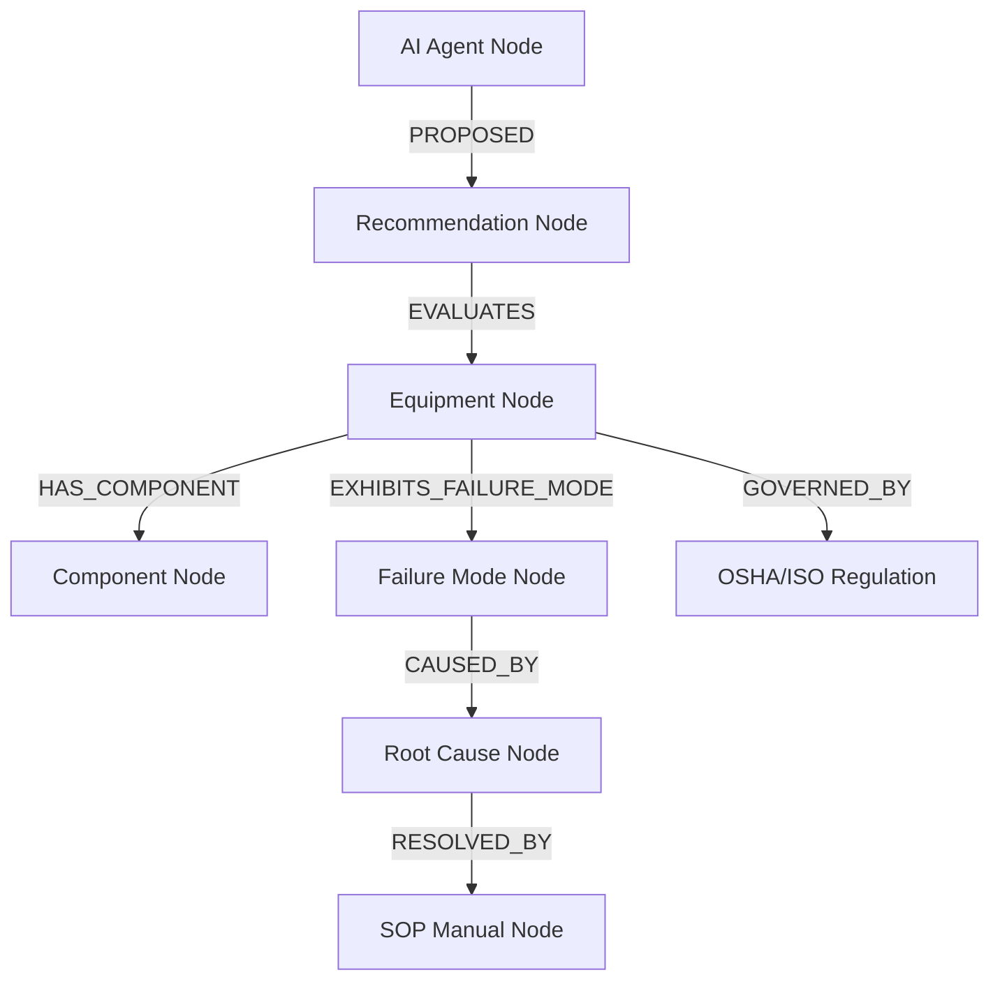

# INDUSMIND AI — 360° Knowledge Graph Architecture Documentation

## 1. Node Types & Attribute Schema

The Knowledge Graph constructs semantic relationships between physical plant assets, operational failure modes, root cause analyses, compliance regulations, and AI agent insights.

### Node Category Reference
1. **Equipment**: Asset Tag, Asset Name, Criticality Index, Health Score.
2. **Component**: Component Name, Part Number, Expected Lifetime.
3. **FailureMode**: Failure Title, MTBF, Severity Level.
4. **RootCause**: Root Cause Title, Mechanical/Thermal Trigger.
5. **SOP**: SOP Number, Maintenance Task Steps, Safety Prerequisites.
6. **Regulation**: Regulation Standard (OSHA 1910.119, ISO 55000), Mandatory Checks.
7. **Discovery**: Pattern Finding, Knowledge Gap, Risk Factor.
8. **Twin**: Asset Snapshot, Health Readiness Index.

---

## 2. Predicate Relationship Matrix

| Predicate | Source Node | Target Node | Meaning |
| :--- | :--- | :--- | :--- |
| `HAS_COMPONENT` | Equipment | Component | Asset contains part/assembly |
| `EXHIBITS_FAILURE_MODE` | Equipment | FailureMode | Asset experienced failure signature |
| `CAUSED_BY` | FailureMode | RootCause | Failure mode stems from root cause |
| `RESOLVED_BY` | RootCause | SOP | Root cause fix documented in SOP |
| `GOVERNED_BY` | Equipment | Regulation | Regulatory standard compliance |
| `AFFECTS` | Discovery | Equipment | Pattern discovery impacts asset |
| `TWIN_OF` | KnowledgeTwin | Equipment | Snapshot is twin of physical asset |
| `VALIDATES` | Feedback | Recommendation | Engineer validation rating |

---

## 3. Graph Traversal & Query Architecture

- **Sub-graph Extraction**: Traverses adjacency lists up to 3 hops deep to extract localized context for AI Copilot prompts.
- **Cache Acceleration**: Uses `knowledge_graph_cache` (10-minute TTL) to guarantee sub-20ms traversal times.
- **JSON-LD Export**: Formats exported graph models into JSON-LD and NetworkX node/edge lists for 2D/3D visualization components.
